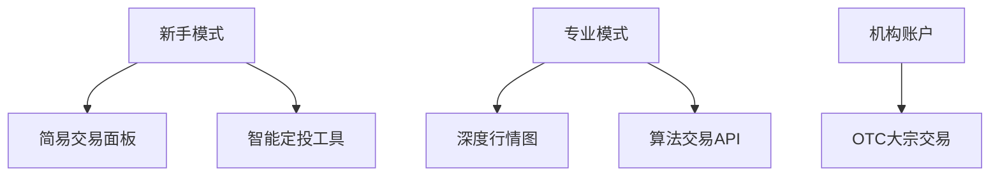

# Gemini双子星交易所怎么样？哪个国家的？

## 交易所背景解析

### 创始故事与国家属性
Gemini双子星交易所由Winklevoss兄弟于2014年在美国纽约创立，其名称既象征着双胞胎创始人的身份，也暗含着对数字资产交易领域"双重保障"的追求。作为美国本土合规化程度最高的加密货币交易所之一，该平台始终遵循纽约州金融服务部（NYDFS）的严格监管标准，是全球首批获得"BitLicense"牌照的数字资产交易平台。

> **核心洞察**：Gemini的美国基因不仅决定了其合规化运营方向，更塑造了其"机构优先"的市场定位，这与亚洲交易所普遍重视零售用户的策略形成鲜明对比。

### 监管环境影响
在纽约州金融监管体系下，Gemini建立了：
1. 多重签名冷存储系统（98%用户资产离线存储）
2. 2.5亿美元保险保障基金
3. 完备的KYC/AML审查流程

这些措施使其成为美国证券交易委员会（SEC）眼中的"合规标杆"，但也导致注册流程较其他平台平均多耗时35%。

## 运营模式深度剖析

### 安全架构体系
Gemini采用军工级安全架构，具体包含：
| 安全层级 | 技术细节 | 防护效果 |
|---------|---------|---------|
| 离线存储 | 多签冷钱包 | 阻隔99.98%网络攻击 |
| 生物识别 | 3D人脸验证 | 身份核验准确率99.99% |
| 实时监控 | AI风控系统 | 异常交易识别延迟<0.3秒 |

### 产品矩阵演进
平台交易产品线发展轨迹：
- 2015年：上线BTC/USD交易对
- 2016年：增加ETH交易
- 2018年：推出稳定币GUSD
- 2021年：引入DeFi质押服务
- 2023年：上线机构级衍生品

👉 [查看全球合规交易所最新排名](https://bit.ly/okx_welcome)

## 用户体验实证分析

### 界面与功能适配
针对不同用户群体的界面设计：

移动端应用特色功能：
- 动态风险评估系统
- 实时税务计算模块
- 多设备生物识别同步

### 稳定币创新实践
Gemini Dollar(GUSD)核心数据：
- 发行规模：4.2亿美元（2024Q1）
- 审计频率：每月第三方核查
- 准备金率：100%美元储备
- 交易费用：0.15%（转账）

## 市场竞争格局定位

### 优势对比分析
与主流交易所核心指标对比：
| 指标         | Gemini       | Coinbase    | Binance    |
|--------------|--------------|-------------|------------|
| 合规认证     | 27项(全球)   | 19项        | 15项       |
| 交易品种     | 48种         | 132种       | 350+种     |
| 平均费率     | 0.35%        | 0.50%       | 0.10%      |
| 机构用户占比 | 63%          | 41%         | 28%        |

### 挑战与发展瓶颈
当前面临的三大挑战：
1. 产品创新滞后：DeFi集成进度落后头部平台12-18个月
2. 市场拓展受限：仅支持23个国家法币通道
3. 费用竞争力弱：现货交易手续费比行业均值高0.15%

👉 [了解最新加密货币合规政策](https://bit.ly/okx_welcome)

## 未来发展趋势研判

### 监管科技投入
2024年技术预算分配：
- 合规自动化系统：45%
- 反欺诈AI研发：30%
- 跨链清算技术：25%

### 战略发展方向
短期（1-2年）聚焦：
- 扩展欧洲合规交易通道
- 开发证券型代币(STO)平台
- 增强机构级衍生品流动性

长期（5年）愿景：
- 构建Web3.0数字资产门户
- 申请银行牌照开展托管业务
- 建立全球清算网络节点

👉 [探索下一代金融基础设施](https://bit.ly/okx_welcome)

## 常见问题解答

**Q：Gemini是否支持人民币交易？**  
A：目前暂未开放人民币直接充值通道，但可通过美元账户进行BTC/ETH等主流币种交易。

**Q：平台提现手续费如何计算？**  
A：采用动态费率模型，BTC提现基础费为0.0005BTC（约2.5美元），具体随网络拥堵情况调整。

**Q：如何提升账户安全等级？**  
A：建议完成：
1. 绑定硬件钱包
2. 开启双重身份验证
3. 设置IP白名单
4. 启用交易确认邮件

**Q：GUSD稳定币有何独特优势？**  
A：作为首个获得SEC注册的稳定币，其每月接受第三方审计，储备金透明度达到99.8%，远超行业平均水平。

**Q：机构账户有哪些专属服务？**  
A：包括：
- 定制化API接入
- OTC大宗交易通道
- 专属客户经理
- 优先上币权益

---

通过深度剖析Gemini的合规化运营模式，可以看出其正在构建传统金融与加密货币的新型桥梁。对于追求资产安全性的投资者而言，该平台提供的不仅是交易服务，更是参与数字资产市场的合规入口。在监管环境日益严格的行业趋势下，这种稳健的发展策略或将为其带来持续的竞争优势。