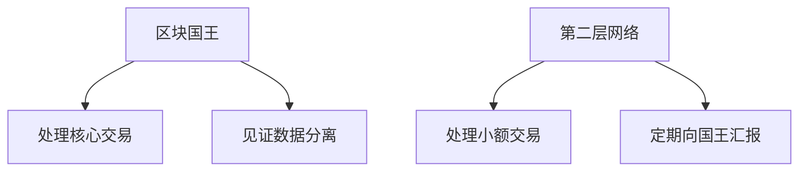

# 币王传第7回：臣妾做不到啊

## 后宫之争：区块链扩容方案的宫斗大戏
区块链技术发展至今，关于比特币扩容的争论始终是行业焦点。本文通过生动的宫斗剧形式，带您深入理解这场技术路线之争的核心矛盾。在延续前文矿霸将军起兵分叉BCH国的剧情基础上，比特币核心团队代表——贵妃娘娘首次公开回应扩容争议，其观点犀利直指区块链发展深层矛盾。

👉 [深度解析区块链技术争议](https://bit.ly/okx_welcome)

## 比特币核心贵妃娘娘的三点核心论断
在白话TV的独家专访中，贵妃娘娘系统阐述了反对直接扩容的三大理由：

1. **网络基础设施瓶颈**
   "区块容量不可能无限扩张，当前每个区块处理交易的极限就像皇宫承重梁，过度加载终将压垮整个系统。当未来日交易量突破亿级，单纯扩容就像给马车装火箭引擎，基础设施根本无法承受。"

2. **中心化风险加剧**
   "大区块将导致独立矿工生存空间被挤压，最终形成'矿霸寡头垄断'。这与比特币去中心化的立国之本背道而驰。试想全国政务都集中到几个大臣手中，这还是开国君主想要的江山吗？"

3. **技术发展路径依赖**
   "直接扩容是饮鸩止渴，就像给肥胖患者穿加大号龙袍。真正的解决方案应该是优化区块结构，为后续技术创新预留空间。"

## 隔离见证：区块链技术的结构化改革
贵妃娘娘用生动的宫廷比喻解释了比特币核心的解决方案：

这种"宫制改革"将见证数据从主区块中剥离，相当于：
1. 让太监宫女处理文书工作
2. 允许地方官员处理日常政务
3. 币王只需专注国家安全级大事

👉 [探索区块链技术前沿应用](https://bit.ly/okx_welcome)

## FAQ：区块链扩容热点问题解答

**Q：隔离见证如何解决交易拥堵？**  
A：通过优化区块结构，相当于给区块链系统安装"分级处理机制"，主链专注安全验证，小额交易通过闪电网络等二层方案处理。

**Q：为什么说直接扩容会导致中心化？**  
A：区块容量越大，存储和验证成本越高。中小矿工将因硬件成本被迫加入矿池，最终形成寡头垄断局面。

**Q：第二层网络是否增加使用门槛？**  
A：相反，闪电网络等方案将大幅提升用户体验，就像建立全国驿站系统，让日常交易如同驿站传书般便捷。

## 技术路线对比分析表

| 方案类型        | 直接扩容(BCH)        | 隔离见证+二层网络(BTC) |
|----------------|----------------------|------------------------|
| 单区块容量     | 32MB(可调)           | 1-4MB(动态调整)        |
| 交易处理量     | 200万笔/日           | 理论无限               |
| 扩展性         | 线性增长             | 指数级扩展             |
| 中心化风险     | ★★★★☆               | ★★☆☆☆                 |
| 技术复杂度     | ★☆☆☆☆               | ★★★★☆                 |
| 生态发展支持   | 单一层级              | 多层架构               |

## 矿工利益格局深度剖析
当被问及"操控国王获利"的质疑时，贵妃娘娘犀利回应："查查加密富豪榜，看看谁才是既得利益者？"数据显示，前20大矿工持有BTC总量不足行业富豪持仓的1/5，这印证了核心团队与矿工群体的利益分离现状。

👉 [洞察加密货币市场格局](https://bit.ly/okx_welcome)

## 未来展望：算力军的终极较量
这场技术路线之争的胜负，最终将取决于算力军的流向选择。当前BTC网络算力占比长期维持在60%以上，而BCH则稳定在10%左右。但正如记者所言："群众的眼光是雪亮的，当二层网络生态成熟度突破临界点，或许就是格局重塑之时。"

这场持续数年的技术路线之争，本质上是区块链发展哲学的碰撞：
- 矿霸将军派主张"实用主义优先"
- 比特币核心坚持"架构可持续性"

您更支持哪种发展路线？欢迎在评论区分享见解，参与这场关于区块链未来的技术思辨。